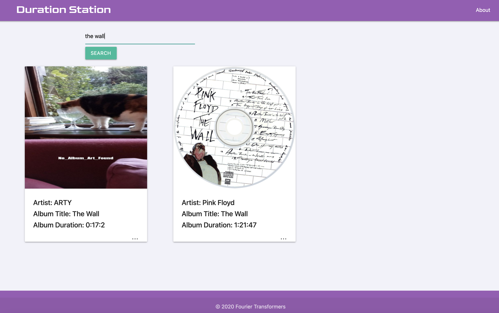

https://github.com/lucahendicott/duration-station

***// . ## ## ##- Duration station. -## ## ## . \\***

### Introduction ###

## A quote from out director:

"The purpose of this app is very simple. Say your friend tells you that you MUST check out Ariana Grande's new album ASAP! However, you might be a busy person. You might be thinking, “Okay maybe I can squeeze the album in on my way to work 🤔 , but I know I’m going to love it so much, I don’t want to start the album and be cut off before I can finish it! 😭 ” Welp! This app allows you to search any album by any artist and it will return to you the album runtime. It’s as simple as that. The app will also display the artist name, album title, an album description if one is available and the album track list. The idea started from just displaying an album runtime and evolved into sort of a mini album encyclopedia generator! What fun!" -lucahendicott

## Our Creation - Our Story

Our creation, the Duration Station started from our first two members, Lucah and Edgar, who both are into music and albums and artists and were hoping to come up with an idea around that using music relevant APIs. Once myself and Brandon joined, Brandon told us about this website that will give you the runtime it would take to finish various video games. Based on that and paired with the musical genre, he suggested that our project be a way to, based on an album search, inform the user on the runtime as to determine whether one would ave the time to listen to the album in its entirety given a certain time constraint. His first idea was to use Microsoft Groove as the api to return us a json we could work with, something id never heard of, yet he assured us everybody used it... Further investigation led us to finding out Brandon hasn't listened to music in over a decade because THE GROOVE HAD BEEN TERMINATED! (Its ok brandon you work for NASA we forgive you, keep sending the spaceships up and bringing our astronauts down my brotha). 

## AudioDB our API

Anyways from there, Brandon being our commander and chief as well as our onboard javaScript specialist produced us a great api.js file using only what I can assume to be what our teacher Thomas calls "the Magic" of javaScript... well that and a bag of chips. 

## The Delegation of Tasks

But I digress. Moreover as a team we brainstormed as well as debugged. Lucah with an edge towards styling, Edgar on his journey traversing the DOM and myself a bit of more or less just being there, being present, overseeing, giving ideas and little fixes as well as writing this witty clever funny README that I hope you just might read again just for fun each time you find yourself using our life changing web application of our coding education!

### Description ###

Our project Duration station is a webpage featuring the Materialize CDN where you are presented with a search box, where you can type the name of an album and using the AudioDB API, it will return as results, the runtime of the album, the artists, and if available the album cover art as well as some description information. If no album art is available, in its place will be a rotating randomly chosen picture of an adorable cat using CatPic API.

## Getting Started

Application runs in browser, no installation or download needed.

## Built With

VSCode- Code editor made by Microsoft
HTML5 - web page "language"
CSS - stylesheet "language"
JavaScript - programming language
jQuery - JavaScript library
Materialize CDN - CSS Framework
Trelo - Mind-Mapping App
GitHub - Version Control "host"

### - Authors - ###

Brandon Tabaska - https://github.com/btabaska
Edgar Pena - https://github.com/edgarpena74
Lucah Endicott - https://github.com/lucahendicott
Luc Foglizzo - ThaA1alpha650 - https://github.com/ThaA1alpha650

### Planned Updates

For the time being we have only one planned update, which was to add a feature that would include information on whether or not the band or performer were on Tour or not and if and where/when they would be available. Unfortunately due to COVID-19 concerts have for the most part been put on hold and so no relevant information was really available for it to be worth it for us to add this functionality at the time being.

### Thank you to all our passengers that have found a way to get off at "The Duration Station" where how long it is "REALLY MATTERS" . 😉😏😏😌

## As Writer of the README, my Contributions

I for myself learned I need to figure out something im particularly good at as to be "that guy" in the next project that does "this or that" side of things with a clear goal in mind. My goal was to not feel utterly useless or like a dead weight and though there is no whole section I can personally take credit for, I know that I Luc, ThaA1alpha650 helped in every way I could think of wherever I was needed.

##~~***

https://github.com/lucahendicott/duration-station